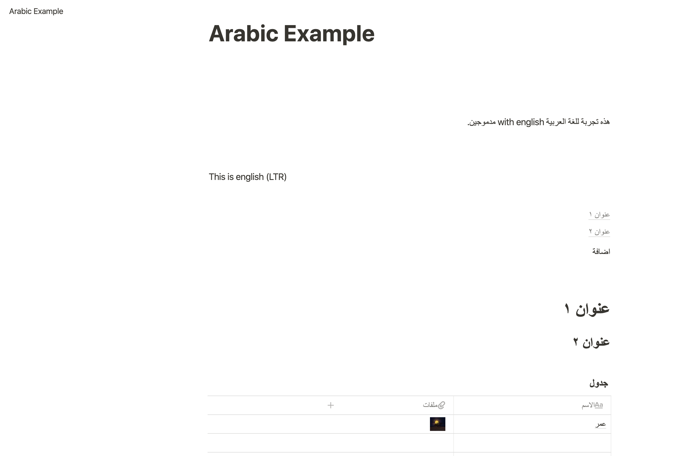

# notion-rtl

A Chrome extension (pending google's review) to enable RTL support in https://notion.so

The extension isn't really doing anything fancy, all it's doing is that it fetches all top-level blocks that
are direct children of `.notion-page-content` that don't have the `dir` attribute, every 200 milliseconds
then it sets `dir="auto"` on those blocks.
